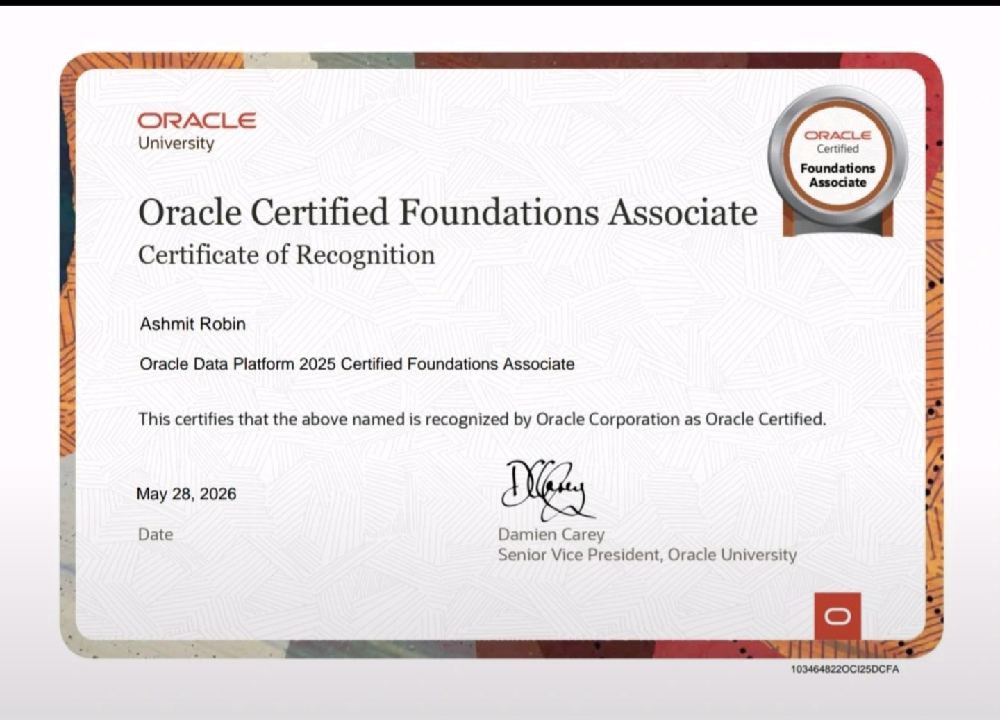
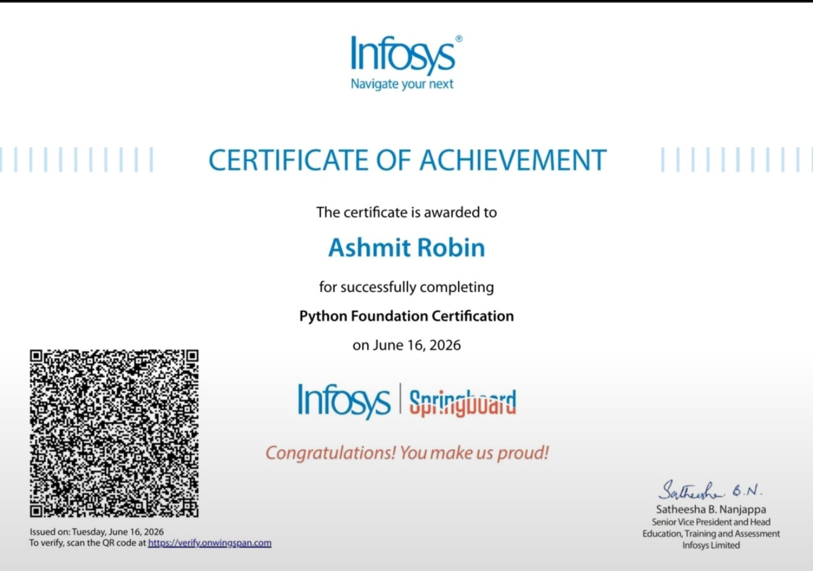
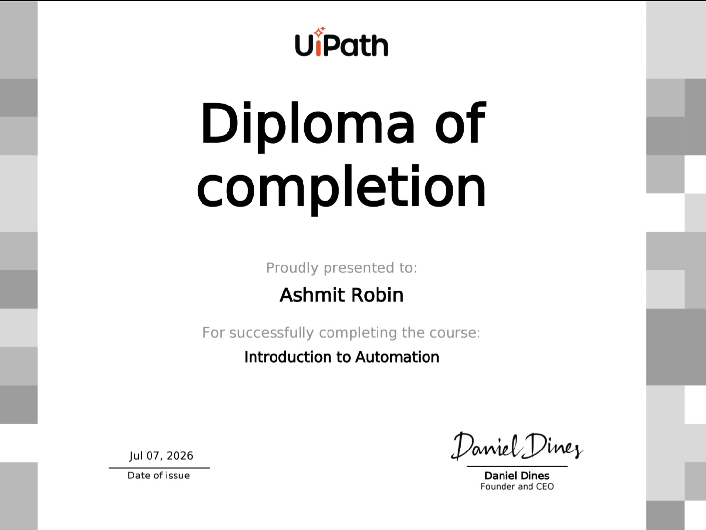
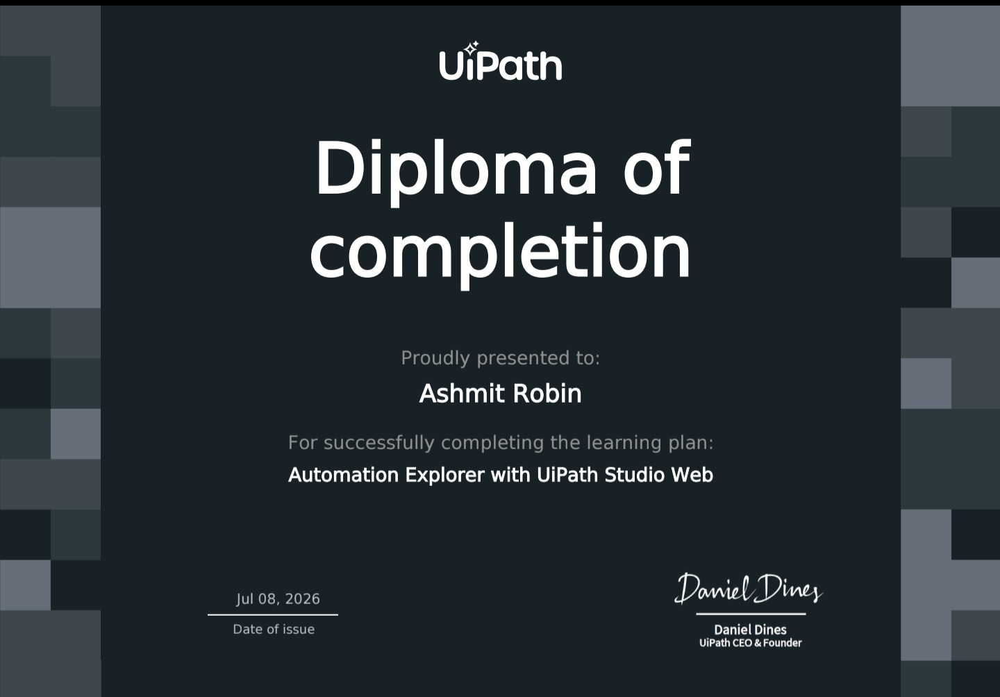

<!-- ============ HERO ============ -->

  

  

    

  
  
  

   

  
  
  

 

<!-- ============ ABOUT ============ -->

  

Hey! I'm **Ashmit Robin**, a second-year BCA student at **Christ University, Bengaluru**. I love crafting efficient, clean and user-friendly software, whether it's backend logic or frontend magic. When I'm not coding, I'm probably exploring new tech stacks or jamming on my guitar.

- 🎸 Lead Guitarist, **Aakrosh Band** (Dept. of Professional Studies)
- 💼 Summer intern at **Suvidha Foundation**
- 🌱 Exploring: Full Stack, APIs and Cloud, DSA in C++

<!-- ============ TECH ARSENAL ============ -->

  
    
  

 

<!-- ============ SPOTLIGHT PROJECT ============ -->

  

  <h3>📊 Faculty Analytical Dashboard</h3>

  

  

    Faculty data from engineering colleges across India is collected, and a statistical dashboard is built on top of it with <b>React + Node.js</b>, using <b>MySQL</b> for storing records.
  

  
  
  
  

  
<a href="https://github.com/AshmitRobin/Faculty-Analytical-Dashboard"><b>➜ View the repository</b></a>

<!-- ============ GITHUB PULSE ============ -->

  
    
  
  
   
  
   
  

 

<!-- ============ CERTIFICATIONS ============ -->

  

  <h4>🏅 Oracle Data Platform 2025: Certified Foundations Associate</h4>
  Oracle University • May 2026  
  

  <h4>🐍 Python Foundation Certification</h4>
  Infosys Springboard • Jun 2026  
  

  <h4>🤖 Introduction to Automation</h4>
  UiPath • Jul 2026  
  

  <h4>⚙️ Automation Explorer with UiPath Studio Web</h4>
  UiPath • Jul 2026  
  

 

<!-- ============ GET IN TOUCH ============ -->

  
    
  
  
  
  

    
  
  

